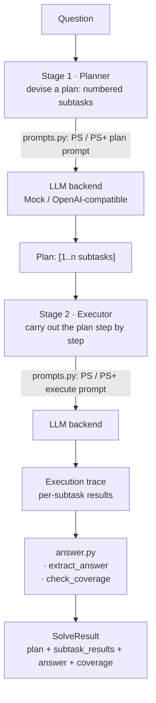

# Plan-and-Solve Agent

A runnable Python implementation of **Plan-and-Solve Prompting** — a zero-shot prompting method that improves Chain-of-Thought reasoning in LLMs by first planning and then executing.

> Wang, L. et al. (2023). *Plan-and-Solve Prompting: Improving Zero-Shot Chain-of-Thought Reasoning by Large Language Models.* ACL 2023. [arXiv:2305.04091](https://arxiv.org/abs/2305.04091)

## The idea

Zero-shot Chain-of-Thought prompting suffers from three pitfalls: **calculation errors**, **missing-step errors**, and **semantic misunderstanding errors**. Plan-and-Solve fixes missing-step errors with a simple two-stage scheme:

1. **Plan** — "Let's first understand the problem and devise a plan to solve the problem." The model divides the task into smaller subtasks.
2. **Execute** — "Then, let's carry out the plan and solve the problem step by step." The model works through the subtasks in order.

The **PS+** variant additionally instructs the model to extract relevant variables and their numerals before planning, and to pay attention to correct numeral calculation and commonsense during execution — targeting calculation errors too.

## Setup

Requires Python 3.9+. No API key or network access needed for the offline demo.

```bash
git clone https://github.com/sulaimanvesal/plan-and-solve-agent.git
cd plan-and-solve-agent
pip install -r requirements.txt
```

## Usage

### Offline demo (MockBackend)

```bash
python examples/demo.py                 # PS variant, 3 math word problems
python examples/demo.py --variant ps-plus
python examples/demo.py --quiet         # answers only
```

### Live run with any OpenAI-compatible API

```bash
export OPENAI_API_KEY=sk-...            # optional: OPENAI_BASE_URL for vLLM / LM Studio / ...
python examples/demo.py --backend openai
```

### In your own code

```python
from plan_and_solve import PlanAndSolveAgent, MockBackend, OpenAIBackend

agent = PlanAndSolveAgent()  # MockBackend by default; fully offline
result = agent.solve("A train travels 60 mph for 2 hours, then 60 mph for 1.5 more hours. Total distance?")

print(result.plan)            # ['Extract the speed and the travel time.', ...]
print(result.subtask_results) # per-subtask execution trace
print(result.answer)          # '210'
print(result.coverage.complete)

# PS+ variant with a real model:
agent = PlanAndSolveAgent(OpenAIBackend(model="gpt-4o-mini"), use_ps_plus=True)
```

## Architecture



## Paper → code mapping

| Paper concept | Where it lives |
|---|---|
| PS plan prompt ("devise a plan…") | `plan_and_solve/prompts.py` → `build_ps_plan_prompt` |
| PS execute prompt ("carry out the plan… step by step") | `plan_and_solve/prompts.py` → `build_ps_execute_prompt` |
| PS+ variable/numeral extraction + careful-calculation instruction | `plan_and_solve/prompts.py` → `build_psplus_*` |
| Stage 1: plan generation + subtask parsing | `plan_and_solve/planner.py` → `Planner.plan` |
| Stage 2: plan execution, trace → per-subtask results | `plan_and_solve/executor.py` → `Executor.execute` |
| Pluggable backends (mock for offline, OpenAI-compatible) | `plan_and_solve/backends.py` |
| Plan → execute → answer orchestration | `plan_and_solve/agent.py` → `PlanAndSolveAgent.solve` |
| Answer extraction + missing-step self-check | `plan_and_solve/answer.py` → `extract_answer`, `check_coverage` |

## Results from the paper

- Plan-and-Solve consistently **outperforms Zero-shot-CoT on 10 datasets** (math, commonsense, symbolic reasoning).
- PS+ gives further gains on math tasks by reducing calculation errors.
- On math reasoning benchmarks, Plan-and-Solve is **comparable to 8-shot Chain-of-Thought** — without any demonstrations.

## Tests

```bash
python -m pytest tests/ -q
```

19 tests cover the prompt wording, planner/executor stages, agent orchestration, determinism, answer extraction, and coverage checks.

## License

MIT — see [LICENSE](LICENSE).
